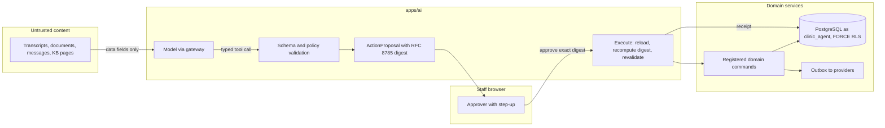

# Threat model: agents, proposals and approvals

- Status: design baseline, 2026-09-24 (todo 2). Mitigations are planned work
  owned by the listed todos unless a current source path is named. Todo 73
  maps each mitigation id to the tests that prove it. A mitigation that
  starts with **Proposal:** goes beyond the owning todo's plan text; that
  todo accepts or rejects it and isn't bound by it until then.
- Decisions: [ADR-008](../adr/ADR-008-workflows-and-approval-binding.md),
  [ADR-019](../adr/ADR-019-service-principals.md),
  [ADR-006](../adr/ADR-006-ai-gateway-routing.md)

## Scope

Agent capabilities that propose or perform actions: care coordination
(AI-05), front desk (AI-04), revenue cycle (AI-06) and analyst reminders
(AI-07). Covers `AgentPolicyVersion`, `AgentRun`, `ActionProposal`,
`Approval`, `ActionExecution`, receipts, compensation, the tool gateway and
the `clinic_agent` database role.

## Assets

- The authority to change clinical, scheduling and financial state.
- Canonical action payloads and their approval digests.
- Approver authority snapshots and step-up evidence.
- Untrusted content the agent reads: transcripts, documents, patient messages,
  knowledge base pages.

## Trust boundaries

1. Untrusted content into the model context.
2. Model output into the tool gateway (proposal validation).
3. Human approver to the approval service (session, step-up).
4. Executor (`clinic_agent` or approving human) to domain services and
   external providers.

## Data flow

## Threats and mitigations

| ID | STRIDE | Threat | Mitigation | Todos |
| --- | --- | --- | --- | --- |
| AA-S1 | Spoofing | An agent acts as a clinician. | Agents run as a `ServicePrincipal` on `clinic_agent`, mapped through `session_user`; a principal never sets `app.current_user_id`. | 7 |
| AA-S2 | Spoofing | A forged approval is recorded without a real approver. | Approval stores the approver authority snapshot, step-up evidence ref and a server attestation HMAC with a dedicated key. | 39 |
| AA-T1 | Tampering | The payload changes after approval. | Approval binds `SHA-256(RFC 8785(payload))`; execution recomputes the digest and refuses a mismatch; duplicate keys, floats, NaN and unknown fields are rejected. | 39 |
| AA-T2 | Tampering | Instructions hidden in a document or message trigger a tool call (prompt injection). | Untrusted content is passed only as data fields; tool calls come from the model's typed output, are validated against schema and policy, and never parsed from content; an injection corpus runs against worst-case fake models. | 39, 49 |
| AA-T3 | Tampering | A proposal based on superseded sources executes. | Payload lists source versions and content hashes; execute-time revalidation rejects stale or superseded sources. | 39, 53 |
| AA-R1 | Repudiation | Nobody can show who approved an effect or what happened. | One execution id per digest, persisted receipts, compensation records; provenance kept in `apps/ai` tables (D-18). | 39 |
| AA-I1 | Information disclosure | An agent reads data outside its grant. | `clinic_agent` grants cover only tables listed per app; RLS helper `principal_has(perm, clinic)`; no SELECT on audit or key tables. | 7 |
| AA-I2 | Information disclosure | The agent exfiltrates data through a tool argument or URL. | No HTTP, shell, SQL, filesystem or browser tools; tool arguments follow closed schemas; egress allowlist. | 39, 49 |
| AA-D1 | Denial of service | A runaway agent floods proposals or executions. | Per-policy budgets and timeouts, per-capability kill switch, tenant fairness on queues. | 9, 39 |
| AA-E1 | Elevation of privilege | Excessive agency: the agent does more than the capability allows. | `AgentPolicyVersion` sets an autonomy ceiling A0 to A3 and a tool allowlist with argument schemas; prescribing and clinical finalization are never tools. | 39, 49 |
| AA-E2 | Elevation of privilege | An approver whose authority was revoked still gets the action executed. | Execute-time revalidation of current authority with DB time; revocation after approval blocks execution. | 39 |
| AA-E3 | Elevation of privilege | A worker dies after a remote effect and a retry doubles it. | Reservation before dispatch, same provider idempotency key on retry, ambiguous outcomes reconciled rather than resent. | 7, 39, 72 |

## Residual risk and external gates

- Models may still produce wrong but schema-valid proposals; human review and
  evaluation (todo 47) are the controls, and live clinical use waits on EG-3.
- Front-desk actions with real patients wait on EG-2 and EG-5.
