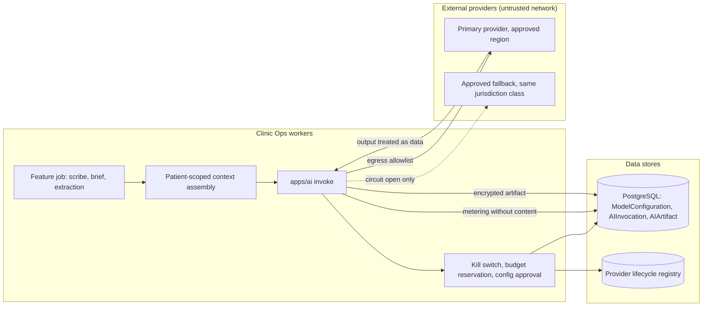

# Threat model: AI gateway

- Status: design baseline, 2026-09-24 (todo 2). Mitigations are planned work
  owned by the listed todos unless a current source path is named. Todo 73
  maps each mitigation id to the tests that prove it. A mitigation that
  starts with **Proposal:** goes beyond the owning todo's plan text; that
  todo accepts or rejects it and isn't bound by it until then.
- Decisions: [ADR-006](../adr/ADR-006-ai-gateway-routing.md),
  [ADR-007](../adr/ADR-007-deterministic-retrieval.md),
  [ADR-014](../adr/ADR-014-observability-redaction.md)

## Scope

Every model call made by Clinic Ops: speech recognition, drafting, briefs,
extraction, front desk, analyst and decision support. Covers `apps/ai`
configuration, invocation, metering, budgets, kill switches, egress and the
provider adapters. Tool execution by agents is in [agents](agents.md).

## Assets

- Prompt inputs assembled from the chart (PHI).
- Model outputs stored as encrypted artifacts.
- Provider credentials and approved model configurations.
- Organization budgets and metering records.
- Kill-switch state.

## Trust boundaries

1. Feature code to the gateway (inside the app, trusted caller).
2. Gateway to the provider lifecycle registry and owner-written configuration.
3. Gateway adapters to external providers over the network.
4. Provider responses back into the app (untrusted content).

## Data flow

## Threats and mitigations

| ID | STRIDE | Threat | Mitigation | Todos |
| --- | --- | --- | --- | --- |
| AG-S1 | Spoofing | A fake or unapproved endpoint receives prompts. | Adapters send only to allowlisted hosts from an approved `ModelConfiguration`; the provider must be `activated` in the lifecycle registry. | 4, 38 |
| AG-S2 | Spoofing | Feature code calls a provider SDK directly and skips the gateway. | Provider adapters exist only as `ProviderProtocol` registrations in `apps/ai`, with the egress allowlist enforced in the adapter base; egress tests refuse non-allowlisted hosts. | 38, 49 |
| AG-T1 | Tampering | A prompt template or model configuration changes without review. | Prompts are versioned in code and identified by sha256; configurations are owner-written and `clinic_app` can only SELECT them; changes need an eval run. | 38, 47 |
| AG-T2 | Tampering | Provider output is trusted as instructions or structured truth. | Outputs are validated against closed schemas and treated as untrusted data; schema failures are rejected. | 38, 49 |
| AG-R1 | Repudiation | Nobody can tell which model and prompt produced an artifact. | `AIInvocation` records purpose, config version, prompt hash, principal and status; provenance lives in `apps/ai`, not in audit payloads (D-18). | 38 |
| AG-I1 | Information disclosure | Prompts or outputs appear in logs, metrics or metering. | Metering stores counts, cost and latency only; allowlist redaction for logs and spans. | 11, 38 |
| AG-I2 | Information disclosure | Data leaves the approved jurisdiction through fallback. | Fallback only to an approved configuration of the same jurisdiction class; no cross-region inference profiles. | 38 |
| AG-I3 | Information disclosure | Context assembly pulls another patient's or tenant's data. | Assembly calls domain services with the caller's permissions; no shared index. | 7, 44, 49 |
| AG-I4 | Information disclosure | Provider retains or trains on clinic data. | Retention and training terms are part of the configuration and approval record; real use waits on EG-2 and EG-5. | 4, 48 |
| AG-D1 | Denial of service | One tenant's AI burst exhausts shared budget or queues. | Budget reservation under a per-organization lock before dispatch; per-tenant fairness on `ai-interactive` and `ai-batch`. | 9, 38 |
| AG-D2 | Denial of service | A provider outage or slowness blocks clinical work. | Circuit breaker per configuration; every feature has a manual fallback; degraded-mode drills. | 38, 72 |
| AG-D3 | Denial of service | Cost runaway from loops or abuse. | Per-purpose and per-organization caps, kill switches checked on every call, usage metering tied to entitlements. | 38, 64 |
| AG-E1 | Elevation of privilege | An organization admin enables a model or region the owner didn't approve. | Owner configures models; org admins can only opt in or out of approved configurations. | 38 |
| AG-E2 | Elevation of privilege | AI runs for an organization that never opted in. | Kill switches default ON: AI stays disabled until the organization opts in and enables the capability in `ClinicConfiguration`; the provider lifecycle and live-activation checks still apply after opt-in. | 38 |

## Residual risk and external gates

- Model availability per region is unverified until EG-5 contracts and
  todo 48 benchmarks.
- Real AI use waits on EG-2; clinical AI waits on EG-3; performance claims
  wait on EG-11.
