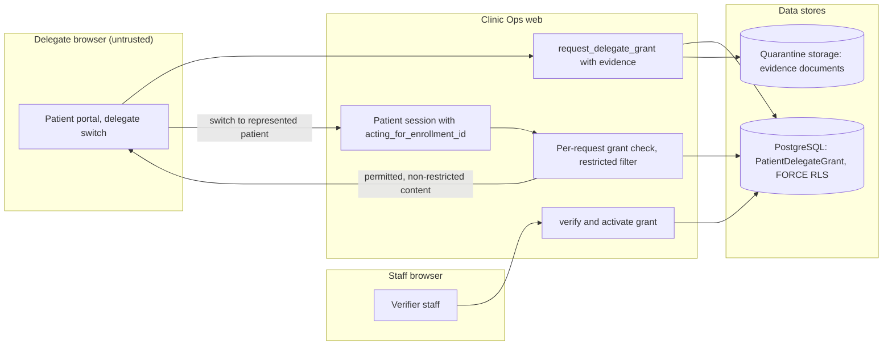

# Threat model: guardian and delegate access

- Status: design baseline, 2026-09-24 (todo 2). Mitigations are planned work
  owned by the listed todos unless a current source path is named. Todo 73
  maps each mitigation id to the tests that prove it. A mitigation that
  starts with **Proposal:** goes beyond the owning todo's plan text; that
  todo accepts or rejects it and isn't bound by it until then.
- Decisions: [ADR-003](../adr/ADR-003-authorization-permission-bundles.md)

## Scope

People acting for a represented patient: legal guardians of minors, curators
and patient-authorized adults. Covers `PatientDelegateGrant`, its verification
by staff, the patient session field `acting_for_enrollment_id`, portal
surfaces and delegate messaging. Patient self-access is already governed by
`apps/intake/patient_access.py` and `docs/clinical/patient-access.md`.

## Assets

- The represented patient's records, results, documents and messages.
- Records flagged `restricted_from_delegates` (psychiatry, adolescent
  confidentiality per clinic policy).
- Evidence documents proving authority (in quarantine storage).
- Grant state and validity windows.

## Trust boundaries

1. Delegate browser to the patient portal (patient session).
2. Grant request and evidence upload to staff verification.
3. Portal requests to domain services (grant re-validated per request).
4. Outbound messages to the delegate's contact channel.

## Data flow

## Threats and mitigations

| ID | STRIDE | Threat | Mitigation | Todos |
| --- | --- | --- | --- | --- |
| DG-S1 | Spoofing | Someone claims guardianship because they hold the patient's phone or email. | Contact possession never grants authority; grants start `pending_verification` and need staff verification against evidence. | 19 |
| DG-S2 | Spoofing | A forged evidence document is accepted. | Evidence goes to quarantine storage and verifier staff record the decision; the verifier identity is kept on the grant. | 19 |
| DG-T1 | Tampering | The delegate edits the grant scope or switches to an enrollment they don't hold. | Session switch re-validates the grant binding on every request; scope is a subset of `PatientAccessGrant` operations and never widens. | 19 |
| DG-R1 | Repudiation | A patient disputes who viewed their record through a delegate. | Grant transitions and delegate actions append registered audit events; the patient-visible access log shows delegate access. | 19, 50 |
| DG-I1 | Information disclosure | A guardian reads restricted content such as adolescent confidential notes. | Records flagged `restricted_from_delegates` are never exposed to delegate sessions; the flag policy is reviewed under EG-2. | 19 |
| DG-I2 | Information disclosure | Results are released to a delegate before the clinician releases them. | Result release is per audience and happens only after clinician acknowledgment and release. | 31, 55 |
| DG-I3 | Information disclosure | Messages meant for the patient go to a delegate, or the reverse. | Messaging purpose and consent are per recipient; delegate context is explicit in the portal banner and in message routing. | 20, 50, 51 |
| DG-D1 | Denial of service | A hostile party revokes or floods grant requests to block the real guardian. | Revocation authority is limited to the grantor and verifier staff. **Proposal:** rate limit grant requests per patient session. | 19 |
| DG-E1 | Elevation of privilege | An expired or revoked grant keeps working in an open session. | Expiry is checked on every use (equality counts as expired); revocation re-validates sessions and closes realtime streams. | 8, 19 |
| DG-E2 | Elevation of privilege | Blanket guardian access covers every record and operation. | Grants carry purposes and allowed operations; there is no blanket grant type. | 19 |

## Residual risk and external gates

- Confidentiality rules for adolescents and psychiatric records depend on
  clinic policy and legal review under EG-2.
- Staff verification quality is a process control; the product records who
  verified what, but can't prove the evidence is genuine.
