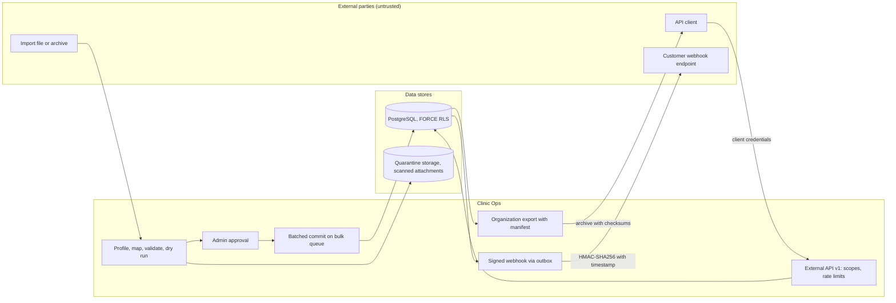

# Threat model: data import, export and external API

- Status: design baseline, 2026-09-24 (todo 2). Mitigations are planned work
  owned by the listed todos unless a current source path is named. Todo 73
  maps each mitigation id to the tests that prove it.
- Decisions: [ADR-017](../adr/ADR-017-additive-migrations.md),
  [ADR-015](../adr/ADR-015-isolation-encryption-search.md)

## Scope

Bulk import from other systems (CSV, XLSX, ZIP with attachments, API),
organization export and offboarding, the versioned external API
(`/api/v1/`) with OAuth2 client credentials, and signed outbound webhooks.
The existing retention export in `apps/retention` is the starting point for
organization export.

## Assets

- Whole-organization datasets in transit (the largest single exposure).
- Import provenance: original ids, authors and timestamps.
- API client secrets and webhook signing secrets.
- Attachments inside import archives (possible malware).

## Trust boundaries

1. Uploaded files into the import pipeline (untrusted content).
2. Import commit into tenant tables (bulk queue, fairness).
3. External API clients to `/api/v1/` (client credentials, no session).
4. Webhook deliveries to customer endpoints.
5. Export archives leaving the system.

## Data flow

## Threats and mitigations

| ID | STRIDE | Threat | Mitigation | Todos |
| --- | --- | --- | --- | --- |
| IE-S1 | Spoofing | Imported notes appear written by the current clinician. | Imported records keep original author and timestamp as `imported` provenance and are never attributed to the importing user. | 66 |
| IE-S2 | Spoofing | A stolen API secret calls the external API. | Secrets are hashed, rotatable and org-scoped; scopes limit resources; revocation is immediate. | 67 |
| IE-S3 | Spoofing | A receiver can't tell a real webhook from a forged one. | HMAC-SHA256 signatures with timestamp; receivers get documented verification steps. | 67 |
| IE-T1 | Tampering | Malformed or hostile files corrupt data during import. | Deterministic validators (CPF, dates, units, codes), dry-run report, admin approval before commit, rejects listed with reasons. | 66 |
| IE-T2 | Tampering | Import merges patients automatically on demographic matches. | Duplicates route to human-adjudicated review; no auto-merge. | 18, 66 |
| IE-T3 | Tampering | Export archive is altered in transit or at rest. | Manifest with per-file checksums; the reconciliation report compares counts, bytes and checksums. | 66, 67 |
| IE-R1 | Repudiation | An import or rollback can't be traced. | `ImportJob` state machine with audited transitions; rollback marks the batch superseded instead of deleting. | 66 |
| IE-I1 | Information disclosure | Patient ids appear in API or webhook URLs. | Opaque external ids; record selectors never in URLs; delivery logs hold no PHI. | 67 |
| IE-I2 | Information disclosure | The API exposes clinical narrative by default. | v1 scopes exclude clinical narrative unless a scope is approved. | 67 |
| IE-I3 | Information disclosure | A full export reaches the wrong person. | Export requires org admin authority with step-up; download links are short-lived and audited. | 67 |
| IE-D1 | Denial of service | A large import starves chart saves for other tenants. | Commit runs in batches on the `bulk` queue with per-tenant fairness. | 9, 66 |
| IE-D2 | Denial of service | API clients flood the service. | Redis token-bucket rate limits per client; idempotency key required on writes. | 67 |
| IE-E1 | Elevation of privilege | A ZIP attachment carries malware into clinical storage. | Attachments are checksummed and scanned in quarantine before linking. | 66 |
| IE-E2 | Elevation of privilege | An archive path escapes the extraction directory (zip slip). | Archive entries are validated against a flat allowlisted layout before extraction. | 66 |

## Residual risk and external gates

- Competitor-specific import formats wait on EG-15 samples; no mappings are
  invented.
- Offboarding is revocation plus export, never user deletion (D-20).
