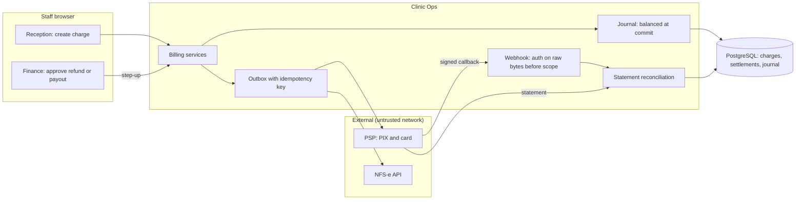

# Threat model: payments, journal and fiscal documents

- Status: design baseline, 2026-09-24 (todo 2). Mitigations are planned work
  owned by the listed todos unless a current source path is named. Todo 73
  maps each mitigation id to the tests that prove it. A mitigation that
  starts with **Proposal:** goes beyond the owning todo's plan text; that
  todo accepts or rejects it and isn't bound by it until then.
- Decisions: [ADR-011](../adr/ADR-011-financial-journal.md),
  [ADR-008](../adr/ADR-008-workflows-and-approval-binding.md)

## Scope

Patient charges (PIX and card through a PSP), settlement callbacks, statement
reconciliation, refunds, payouts, cash close, the operational journal and
NFS-e fiscal documents. Clinic Ops' own SaaS subscription billing is in scope
only where it touches the same adapters.

## Assets

- Money movements: charges, settlements, refunds and payouts.
- Journal integrity (balance, single posting, immutability).
- PSP credentials and webhook secrets.
- Patient payment data kept by the PSP (card data never enters Clinic Ops).
- Fiscal documents and their authorization status.

## Trust boundaries

1. Staff browser to billing services (session, step-up for approvals).
2. Outbox worker to the PSP and NFS-e APIs.
3. PSP callbacks into the webhook endpoint (sessionless, D-19).
4. Statement import into reconciliation.

## Data flow

## Threats and mitigations

| ID | STRIDE | Threat | Mitigation | Todos |
| --- | --- | --- | --- | --- |
| PY-S1 | Spoofing | A forged PSP callback marks a charge paid. | Callbacks are authenticated on raw bytes before any scope lookup (current pattern `apps/billing/reconciliation.py`); payload tenant claims are never read. | 57 |
| PY-S2 | Spoofing | A charge is marked paid when the QR code is created. | Paid state comes only from a verified settlement matched to a statement line. | 57 |
| PY-T1 | Tampering | The callback amount differs from what was charged. | Reconciliation matches provider reference, amount and currency; mismatches go to quarantine. | 57 |
| PY-T2 | Tampering | A posted journal entry is edited. | Posted entries are immutable; corrections are linked reversals; a deferred trigger enforces balance. | 56 |
| PY-T3 | Tampering | Rounding or splits create or lose cents. | Integer centavos, half-even rounding at versioned boundaries, largest-remainder allocation. | 56 |
| PY-R1 | Repudiation | Nobody can show who approved a refund or payout. | Refund and payout approvals need finance authority and step-up; approvals and transitions are audited. | 6, 56 |
| PY-I1 | Information disclosure | Card data or payment tokens leak into logs or outbox rows. | Card entry happens at the PSP; outbox rows and `last_error` hold no payment or patient data; PHI-sentinel scans. | 11, 57, 73 |
| PY-D1 | Denial of service | A PSP outage blocks reception. | Degraded mode keeps manual payment recording with clear status; no silent provider switch. | 57, 72 |
| PY-D2 | Denial of service | A failed SaaS subscription payment locks clinics out of records. | Restriction never blocks record access, export, reconciliation or continuity of care. | 64 |
| PY-E1 | Elevation of privilege | Reception approves its own refund. | Role matrix separates request and approval; refunds need finance approval. | 6, 56 |
| PY-E2 | Elevation of privilege | A replayed or out-of-order callback posts twice. | Unique posting identity per economic fact; idempotent callback handling; replay tests. | 56, 57 |
| PY-E3 | Elevation of privilege | A worker dies after the PSP moved money and a retry pays out twice. | Reservation before dispatch; retries reuse the provider idempotency key and look up status first. | 57, 72 |

## Residual risk and external gates

- Real PSP use waits on EG-1 and EG-5; NFS-e live issuance waits on EG-9.
- Tax classification is never guessed; the fiscal reviewer decides per clinic.
- Clinic Ops' own subscription collection waits on EG-18.
