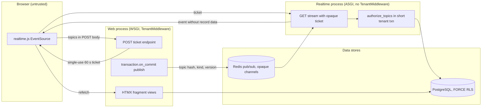

# Threat model: realtime event channel

- Status: design baseline, 2026-09-24 (todo 2). Mitigations are planned work
  owned by the listed todos unless a current source path is named. Todo 73
  maps each mitigation id to the tests that prove it. A mitigation that
  starts with **Proposal:** goes beyond the owning todo's plan text; that
  todo accepts or rejects it and isn't bound by it until then.
- Decisions: [ADR-002](../adr/ADR-002-realtime-sse.md),
  [ADR-018](../adr/ADR-018-connection-pooling.md)

## Scope

Server-sent events that tell staff and patient browsers to refetch the agenda,
reception queue, inbox, messages and AI job status. Covers the ticket
endpoint, the separate ASGI process, Redis pub/sub and the browser client.
Refetching data goes through the normal tenant request path and is covered by
existing tenancy controls.

## Assets

- Topic membership: which clinic, user or job a stream follows.
- Event timing and volume, which can hint at clinical activity.
- Session cookies and single-use stream tickets.
- Database connections in the realtime process.

## Trust boundaries

1. Browser to the ticket endpoint (session, CSRF, OTP).
2. Browser to the stream endpoint (opaque ticket only).
3. Realtime process to PostgreSQL (short tenant transaction per check).
4. Web and worker processes to Redis pub/sub (publish on commit).

## Data flow

## Threats and mitigations

| ID | STRIDE | Threat | Mitigation | Todos |
| --- | --- | --- | --- | --- |
| RT-S1 | Spoofing | A stolen or replayed stream URL opens another user's stream. | Tickets are opaque, single-use and expire after 60 s. **Proposal:** bind the stream to the session that minted the ticket. | 8 |
| RT-S2 | Spoofing | A cross-site page mints a ticket with the victim's cookie. | Ticket creation is a POST with CSRF and OTP checks, and the ticket is returned only in the response body. | 8, 10 |
| RT-T1 | Tampering | A client forges events or injects messages into Redis. | The stream is one-way; channel names are `rt:<sha256(topic+secret)>`; Redis is private to the deployment. Events only trigger a refetch that goes through normal authorization. | 8 |
| RT-R1 | Repudiation | Nobody can tell who subscribed to what after an incident. | Ticket issuance and denials record reason codes and request ids through the audit and telemetry allowlists, with no topic contents. | 8, 11 |
| RT-I1 | Information disclosure | Events carry patient names, ids or text. | Event schema is exactly `{topic_hash, kind, version}`; a PHI-sentinel scan covers SSE output. | 8, 73 |
| RT-I2 | Information disclosure | A user subscribes to another clinic's or patient's topic. | `authorize_topics` runs `require_permission` in a tenant transaction; unknown and forbidden topics return the same 403 shape. | 6, 8 |
| RT-I3 | Information disclosure | Record ids appear in the stream URL and leak through logs or referrers. | Topics travel in the POST body; the GET carries only the opaque ticket. | 8 |
| RT-D1 | Denial of service | Many open streams hold database connections or transactions. | The realtime process uses `CONN_MAX_AGE=0`, checks run in short transactions, and connections are capped at 10 min. | 8 |
| RT-D2 | Denial of service | A publish storm from one tenant delays others. | Publishing happens on commit only; fairness quotas throttle bursty queues; clients fall back to polling. | 8, 9, 71 |
| RT-E1 | Elevation of privilege | A revoked user keeps receiving events on an open stream. | Reauthorization every 60 s and an immediate close on the `authz:user:<id>` message published by revocation, logout and live-halt. | 8, 15 |
| RT-E2 | Elevation of privilege | App HTTP traffic is routed through the ASGI process and skips `TenantMiddleware`. | The realtime settings module mounts only the stream routes; a test proves other routes aren't served there. | 8 |

## Residual risk and external gates

- Event timing still reveals that something changed in a clinic. The design
  accepts that because topics are coarse and hashed.
- Load behavior is L1 evidence from todo 71 until a hosted environment exists.
