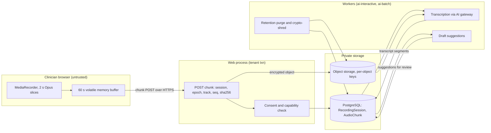

# Threat model: scribe audio capture and media storage

- Status: design baseline, 2026-09-24 (todo 2). Mitigations are planned work
  owned by the listed todos unless a current source path is named. Todo 73
  maps each mitigation id to the tests that prove it. A mitigation that
  starts with **Proposal:** goes beyond the owning todo's plan text; that
  todo accepts or rejects it and isn't bound by it until then.
- Decisions: [ADR-005](../adr/ADR-005-chunked-media-upload.md),
  [ADR-004](../adr/ADR-004-server-side-drafts.md),
  [ADR-016](../adr/ADR-016-recovery-with-key-escrow.md)

## Scope

Consented consultation audio from the browser (and the teleconsult recording
path) through chunk upload, encrypted object storage, transcription and
drafting, to retention and purge. Covers `apps/scribe`, the capture script,
the object storage capability `object_storage_media` and the ASR queue.

## Assets

- Raw consultation audio (highest sensitivity).
- Transcripts, draft suggestions and the AI-use record in the chart.
- Consent and recording refusal records.
- Per-object data keys and tenant keys.
- Chunk ordering and coverage manifests (integrity of what was said).

## Trust boundaries

1. Browser microphone and memory to the chunk upload endpoint.
2. Web process to private object storage.
3. Worker to the AI gateway and ASR provider.
4. Retention worker to object storage and backups.

## Data flow

## Threats and mitigations

| ID | STRIDE | Threat | Mitigation | Todos |
| --- | --- | --- | --- | --- |
| SM-S1 | Spoofing | Chunks are uploaded for a session the uploader doesn't own, or after a patient switch. | Chunks are accepted only for the session bound to the current encounter token and the assigned clinician with active consent; a patient switch forces stop, discard or keep-bound. | 40 |
| SM-S2 | Spoofing | Recording starts without patient consent. | `RecordingSession` moves to `authorized` only with consent refs from the purpose taxonomy; a refusal hides capture. | 20, 40 |
| SM-T1 | Tampering | Chunks are reordered, replayed or altered, changing what the transcript says. | Chunk key `(session, epoch, track, seq)` plus sha256; conflicting duplicates are rejected; stale epochs are refused; transcripts carry a gap manifest and never fill gaps. | 40, 41 |
| SM-T2 | Tampering | A late model result overwrites text the clinician already edited. | Generation fence per draft revision and section edit epochs; suggestions are never auto-applied. | 42 |
| SM-R1 | Repudiation | A clinician can't show which parts of a note came from AI. | AI-use record and provenance tags persist after acceptance and are visible in the chart. | 42 |
| SM-I1 | Information disclosure | Audio persists on the device through IndexedDB, localStorage or the service-worker cache. | Memory-only buffer, capped at 60 s from capture time; no browser storage; a browser test inspects storage after capture. | 40, 14 |
| SM-I2 | Information disclosure | Audio or transcripts leak through logs, URLs or telemetry. | Selectors in POST bodies; allowlist redaction; PHI-sentinel scans over logs, outbox and URLs. | 11, 40, 73 |
| SM-I3 | Information disclosure | Stored audio is readable by anyone with bucket access. | Private storage behind the `object_storage_media` capability, per-object data key wrapped by the tenant key. | 40, 72 |
| SM-I4 | Information disclosure | Purged audio survives in backups or comes back after a restore. | Purge receipts record the backup expiry date honestly; restore drills re-apply purge tombstones. | 43, 72 |
| SM-D1 | Denial of service | Network loss makes the UI claim recording continues when it doesn't. | Buffer exhaustion auto-pauses with a visible message; expired chunks are discarded; TTL never resets on reconnect. | 40 |
| SM-D2 | Denial of service | ASR provider outage blocks documentation. | Degraded mode falls back to manual documentation with no silent provider switch. | 38, 41, 72 |
| SM-E1 | Elevation of privilege | A draft suggestion finalizes the note or writes as the clinician. | Apply is the clinician's own `record_clinical_note` call with CAS; approval of a suggestion never finalizes SOAP. | 42 |
| SM-E2 | Elevation of privilege | Teleconsult recording is switched on without a bound session. | The teleconsult trigger allows recording only while a `RecordingSession` for the room's encounter is authorized, recording or paused. | 40 |

## Residual risk and external gates

- Real-device capture behavior (screen lock, interruptions) is unproven until
  EG-14 device runs.
- Live recording needs EG-2 privacy review and EG-3 clinical safety sign-off.
- Provider retention terms for audio are unverified until EG-5 contracts.
