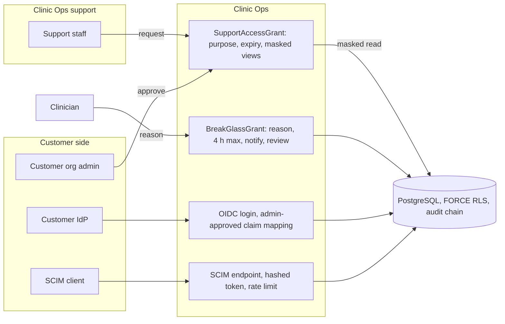

# Threat model: support access, break-glass and enterprise identity

- Status: design baseline, 2026-09-24 (todo 2). Mitigations are planned work
  owned by the listed todos unless a current source path is named. Todo 73
  maps each mitigation id to the tests that prove it.
- Decisions: [ADR-003](../adr/ADR-003-authorization-permission-bundles.md),
  [ADR-014](../adr/ADR-014-observability-redaction.md)

## Scope

Clinic Ops support staff reaching a customer tenant through just-in-time
grants, clinician break-glass access to a patient outside the care team, OIDC
single sign-on and SCIM provisioning. Database administration through
`clinic_super` is out of scope here; it's tests and admin only and covered by
[SECURITY.md](../SECURITY.md).

## Assets

- Tenant data seen by support staff.
- Records reached through break-glass.
- Role mappings from identity provider claims and SCIM groups.
- SCIM bearer tokens and SSO client secrets.

## Trust boundaries

1. Support staff to the tenant (customer admin approval required).
2. Clinician to an out-of-scope patient (break-glass reason and expiry).
3. Customer identity provider to Clinic Ops (OIDC).
4. SCIM client to the SCIM endpoint (sessionless, D-19).

## Data flow

## Threats and mitigations

| ID | STRIDE | Threat | Mitigation | Todos |
| --- | --- | --- | --- | --- |
| SA-S1 | Spoofing | Support staff access a tenant without the customer knowing. | `SupportAccessGrant` requires customer admin approval, a purpose and an expiry; there's no universal support bypass. | 65 |
| SA-S2 | Spoofing | A forged or misconfigured IdP assertion logs in as a clinic user. | OIDC with discovery and PKCE per organization connection; claims map to roles only through admin-approved mappings. | 65 |
| SA-S3 | Spoofing | A leaked SCIM token provisions users. | SCIM tokens are hashed, org-scoped, rate limited and revocable. | 65 |
| SA-T1 | Tampering | Support staff change clinical records. | Support principals never get clinical write; views are masked by default. | 65 |
| SA-R1 | Repudiation | Break-glass use goes unreviewed. | Reason required, clinic manager notified at once, patient-visible access log entry, mandatory post-event review task. | 26, 65 |
| SA-R2 | Repudiation | Support actions can't be tied to a person. | Every support grant and action is audited against the named support user and grant id. | 65 |
| SA-I1 | Information disclosure | Support sees more than the ticket needs. | Masked-by-default views; unmasking is a separate, audited step inside the grant purpose. | 65 |
| SA-I2 | Information disclosure | Support diagnostics pull PHI into tickets. | Diagnostics use allowlisted telemetry and request ids, never payloads. | 11, 78 |
| SA-D1 | Denial of service | A SCIM sync deprovisions every user by mistake. | Offboarding is revocation, never deletion (D-20); SCIM changes are rate limited and audited so they can be reversed. | 15, 65 |
| SA-E1 | Elevation of privilege | IdP group claims grant admin roles automatically. | No automatic role elevation from claims without an approved mapping; bundles can't widen past professional scope. | 6, 65 |
| SA-E2 | Elevation of privilege | Break-glass is used for non-clinical access or lasts indefinitely. | Break-glass is clinical only, scoped to patient or encounter, capped at 4 h. | 65 |
| SA-E3 | Elevation of privilege | A revoked support or break-glass grant keeps working in an open session. | Grants are checked on every request; revocation closes realtime streams through the `authz:user:<id>` channel. | 8, 65 |

## Residual risk and external gates

- An insider with database superuser access is outside this model; see the
  threat boundary in [SECURITY.md](../SECURITY.md) and EG-12.
- SAML is added only if a customer IdP requires it, with its own threat
  review.
