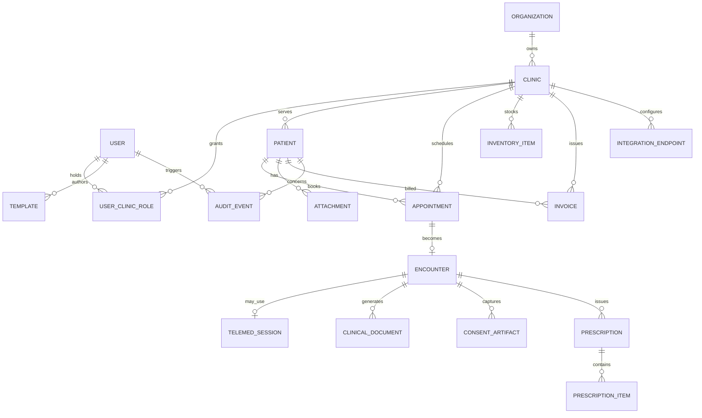
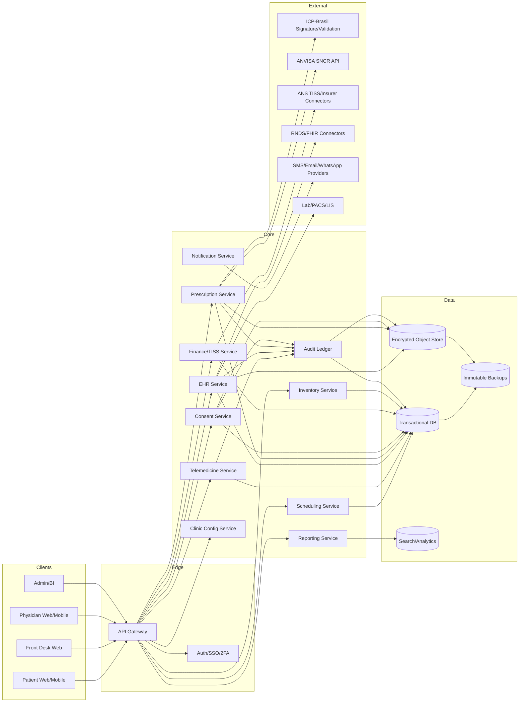
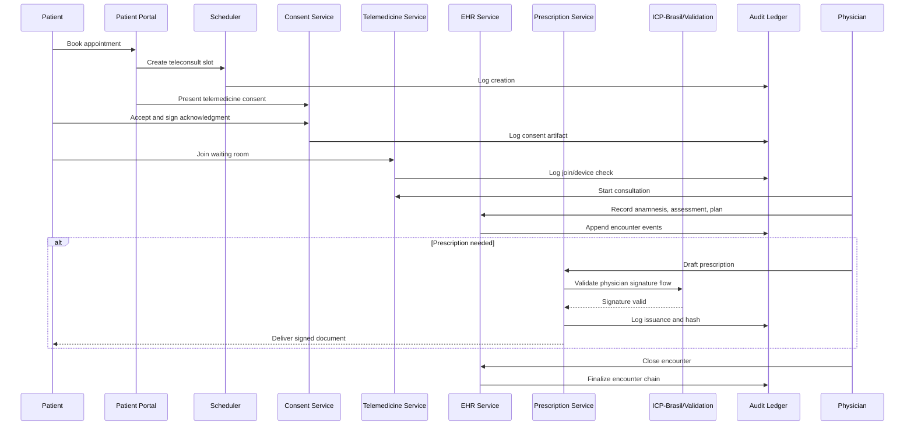
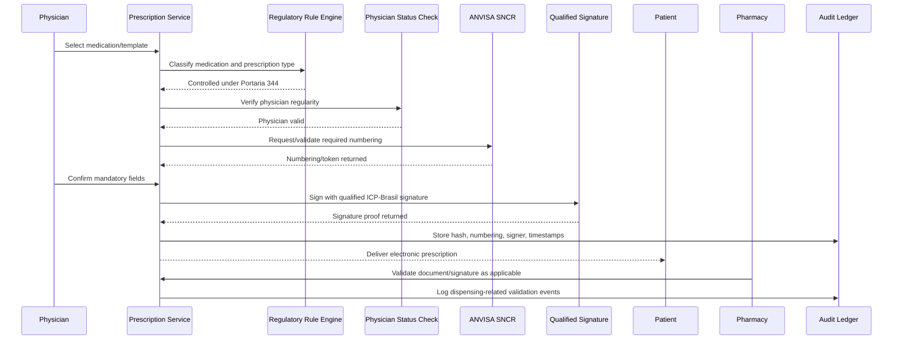

# Brazil-Focused Outpatient Clinic OS

## Executive summary

The product opportunity is clear: build a **Brazil-first outpatient clinic operating system** for small clinics and private practices that keeps the convenience layer patients already expect from Doctoralia-style online booking, reminders, and teleconsultation, but makes **documentation, traceability, signatures, consent, controlled-substance prescribing, and privacy compliance materially stronger** than most current SMB clinic tools. Brazilian law now gives a stable baseline for telehealth, while CFM, ANVISA, ANS, LGPD/ANPD, and the Ministry of Health impose a set of design constraints that many clinics still satisfy in an improvised way through fragmented tools, PDFs, messaging apps, and manual workflows. That is precisely the gap this system should close. citeturn28view0turn25view0turn43view0turn30search1turn46search0

The recommended product thesis is: **“Doctoralia-grade convenience, hospital-grade medico-legal defensibility, SMB-grade simplicity.”** In practice, that means a cloud-first, multi-tenant clinic platform with a strong outpatient core: scheduling, reminders, teleconsultation, EHR, prescription workflows, billing, TISS support, inventory, patient communication, reporting, consent management, role-based access, and immutable audit trails—plus a compliance backbone engineered for Brazil from day one. The system should treat **prontuário, consent, signature validation, retention, controlled-prescription numbering, and evidence preservation** as first-class architecture concerns, not afterthoughts. citeturn29search8turn25view0turn47view0turn35view0turn36view0turn43view0

The strongest strategic decision is to **design for modular compliance tiers**. A low-cost clinic can start with scheduling, reminders, teleconsultation, standard e-prescription, EHR, and cash billing. The same codebase can then activate advanced modules for health-plan billing (TISS), controlled-substance workflows (SNCR integration), richer audit evidence, and formal S-RES certification readiness. This keeps implementation commercially viable while preserving a path to higher trust and defensibility. ANS makes TISS mandatory for electronic exchange in supplemental health; ANVISA’s SNCR is centralizing numbering and electronic control for controlled prescriptions; CFM requires compliant electronic documents and secure telemedicine records; and LGPD/ANPD increasingly expect demonstrable governance, incident response, and accountability. citeturn30search1turn30search0turn35view0turn33view0turn25view0turn43view0

My design recommendation is to position the product not as a broad hospital HIS or MV-style enterprise platform, but as an **outpatient clinic OS** optimized for: low administrative headcount, multi-doctor shared agendas, per-specialty templates, fast note-taking, telemedicine readiness, Brazilian signature/prescription rules, and legally robust recordkeeping. That is the segment where incumbents are often either too marketing-heavy and light on documentation controls, or too operationally heavy and difficult to use. Publicly advertised features show Doctoralia is strong on convenience and patient acquisition; iClinic, Feegow, and Shosp cover broader clinic operations; Feegow publicly advertises SBIS-certified EHR; and several platforms offer teleconsultation and online scheduling. The white space is not “features alone,” but **compliance-centered workflow design presented through a simpler UX**. citeturn29search12turn29search4turn29search1turn29search2turn29search3turn29search18

## Regulatory baseline for Brazil

### What the system must satisfy

Brazil’s telehealth legal baseline is the combination of **Law 14.510/2022** and the profession-specific ethical rules of the **CFM** for medicine. Law 14.510 inserted Title III-A into Law 8.080 and states that telessaúde must respect professional autonomy, patient free and informed consent, the patient’s right to refuse remote care and request in-person care, confidentiality of data, and digital responsibility. It also states that remote professional acts are valid nationwide and that the federal professional councils remain responsible for ethical regulation in their sectors. citeturn28view0

For physicians specifically, **CFM Resolution 2.314/2022** defines and regulates telemedicine. It permits telemedicine synchronously or asynchronously, requires preservation of patient data and images in the record, requires telemedicine attendance to be registered in a physical or electronic medical record, and requires the S-RES used in telemedicine to meet **NGS2** and appropriate standards for interoperability, confidentiality, privacy, and integrity. The resolution also states that teleconsultation is a non-presential consultation mediated by digital technologies, that the in-person consultation remains the “gold standard,” and that, for chronic or long-term conditions, an in-person consultation with the assistant physician must occur at intervals not exceeding 180 days. It further states that the physician must explain teleconsultation limitations, may require in-person attendance to conclude the consultation, and that both patient and physician may interrupt the remote visit in favor of presencial care under the consent terms established between them. citeturn47view0

The system therefore needs a **telemedicine compliance layer**, not just video calling. That layer must cover: identity of professionals, informed consent capture, structured clinical documentation, evidentiary timestamps, secure transmission, controlled issuance of documents, explicit guidance on mode limitations, and safe escalation to in-person care. A clinic that merely uses a generic messaging app or video link without integrated recordkeeping, signatures, consent artifacts, and secured data handling would struggle to satisfy this combined legal and ethical baseline. citeturn28view0turn47view0turn25view0turn16view0

Brazil’s privacy baseline is the **LGPD**. Health data is explicitly classified as **sensitive personal data**, and its processing is allowed only under the legal hypotheses in Article 11, including specific consent or, without consent, when indispensable for legal/regulatory compliance, regular exercise of rights, protection of life, or **tutela da saúde** by health professionals or health entities. The LGPD also imposes the principles of purpose limitation, adequacy, necessity, prevention, non-discrimination, and accountability. Data subjects have rights of confirmation, access, correction, anonymization/blocking/elimination where applicable, portability, information on sharing, and review of consent-based processing. Controllers must designate an **encarregado** unless a valid small-agent exemption applies; they must also adopt technical and administrative security measures from design through operation, keep treatment-operation records, and notify the ANPD and affected data subjects about reportable security incidents. citeturn16view0turn42view0turn42view1turn42view2turn42view3turn42view4

The **ANPD** has made the incident-notification expectation more concrete. Its current communication guidance, based on **Resolution CD/ANPD 15/2024**, says that controllers must notify the ANPD and affected data subjects within **three business days** when an incident may cause relevant risk or damage, subject to sector-specific deadlines if stricter. The ANPD also explains that notification to the authority alone is insufficient; the affected data subjects must also be notified where risk or damage is relevant. For small agents, Resolution CD/ANPD 2/2022 allows some flexibilization, including DPO exemption, but it does **not** exempt them from LGPD principles, legal bases, fundamental security duties, or compliance with the rest of the law. Even a small clinic product should assume that health-data processing is high consequence and should implement full governance patterns by default. citeturn43view0turn44view0

Electronic medical documents are governed largely by **CFM Resolution 2.299/2021**. It authorizes TDIC-based issuance of prescription, certificate, report, exam request, report, and technical opinion for both in-person and remote care. Required document fields include physician identification, patient identification, date/time, and the physician’s digital signature. Patient data transmitted on the internet must travel with infrastructure and risk management adequate to protect integrity, veracity, confidentiality, privacy, and medical secrecy. The physician remains responsible for the information, and the resolution requires **digital signatures generated with certificates and keys issued by ICP-Brasil with NGS2**, with validation possible through ITI or a validator provided by CFM. If the physician uses a prescription portal or platform, the institution must be registered with the appropriate CRM, name a medical director, and document to physicians that it complies with legal and CFM requirements. The platform must also verify that the prescriber is a physician in regular standing, either through CFM public automated consultation services or CFM-issued attribute certificates. citeturn25view0

Electronic signatures in health also sit under **Law 14.063/2020**. The law defines simple, advanced, and qualified signatures, states that qualified signatures have the highest reliability, and establishes in Article 13 that **electronic prescriptions for controlled medicines and electronic medical certificates are only valid if subscribed with a qualified electronic signature by the health professional**. That makes a qualified ICP-Brasil signature non-negotiable for controlled-substance e-prescriptions. For other document types and other medication categories, the picture is more nuanced because ANVISA now allows advanced signatures in some scenarios outside Portaria 344 controlled substances. citeturn41view0turn33view0

For medicines under **Portaria SVS/MS 344/1998** and its later updates, ANVISA is the critical regulator. **RDC 873/2024** instituted the **Sistema Nacional de Controle de Receituários (SNCR)** to manage the distribution of numbering for notifications and receipt books nationwide, and it requires sanitary authorities to use SNCR for that purpose. It also preserved the rule that prescription numbering granted by an authority is to be used only in the same federative unit that granted it. The system and the numbering logic cover controlled categories such as the A, B, C2, and C3 notification types identified in the regulation. citeturn35view0turn36view0

ANVISA’s newer **RDC 1.000/2025** and its 2026 official Q&A materially change system design. The agency explains that the rule does **not** eliminate paper prescriptions and does **not** make electronic prescribing mandatory, but it creates explicit requirements for electronic controlled, retention-subject, and other regulated prescriptions. The Q&A states that, for digital prescriptions, **controlled medications under Portaria 344 require qualified ICP-Brasil signatures with no exceptions**; by contrast, **advanced signatures** may be used for non-controlled digital prescriptions, including standard prescriptions and some prescriptions subject to retention such as **antimicrobials** and **GLP-1 receptor agonists**, provided the signature method permits validation of authenticity and integrity. ANVISA also stated that requirements for integration of prescription systems to the SNCR would be published by 1 June 2026, and by 30 June 2026 the agency had in fact published technical documentation, an API, and a training environment for integrators. citeturn33view0turn34view0turn37search0turn37search1

From a product-design perspective, that means prescription templates are allowed and commercially valuable, but the system must never let templates bypass **mandatory fields, signature class, SNCR numbering, prescriber validation, or state-specific numbering constraints**. The template engine must be rule-aware. It should dynamically harden the form when the selected medication falls under Portaria 344 or another controlled/retention regime and choose the correct path: qualified signature only, SNCR-linked numbering where applicable, printable fallback where regulation still requires interim paper annotations, and explicit validation UX for pharmacies and patients. citeturn25view0turn33view0turn34view0turn36view0

Recordkeeping and retention are essential because medico-legal disputes in Brazil frequently turn on the completeness, chronology, and integrity of the medical record. **CFM Resolution 1.638/2002** defines the medical record as the unique document composed of information, signs, and images generated from facts and events about the patient’s health and care, of legal, confidential, and scientific character, and it requires review commissions in health institutions. **CFM Resolution 1.821/2007** then authorizes digitalization and use of computerized systems for health records and states that records archived electronically should have **permanent** preservation, while paper records have a minimum of 20 years after the last entry. Later, **Law 13.787/2018** states that, after digitalization and in the case of electronic patient records, the storage period is at least **20 years from the last entry**. Because these norms can be read in different ways—older CFM rule favoring permanent retention for electronic archives, later federal law setting a statutory minimum—it is prudent for a medico-legally conservative product to implement **policy-based retention with permanent default for native electronic clinical records**, or at minimum very long retention with legal-hold capability, while allowing counsel-approved disposal processes for non-clinical data classes. citeturn39search0turn6view0turn10search5

For interoperability with private insurers, **ANS TISS** matters. The ANS states that TISS is the **mandatory standard** for electronic exchange of health-attention data among supplemental health actors, and its purpose is to standardize administrative actions, support evaluation, and compose the electronic health record. The current ANS portal shows updated TISS versions continuing into 2026. This means a clinic OS that expects to serve insured outpatient practices should ship a TISS connector early, even if billing can be optional in the first SMB release. citeturn30search1turn30search0

The Ministry of Health’s **RNDS** is also relevant even if not mandatory for every private clinic product on day one. The Ministry describes RNDS as the national interoperability platform for health data and states that its modeling follows **HL7 FHIR**. That makes RNDS/FHIR compatibility strategically attractive for future-proofing, referrals, SUS-connected workflows, and national data-sharing use cases. citeturn46search0turn46search11turn45search0turn45search9

### Certification and registration path

The practical certification path for an outpatient clinic OS should be treated as a staged compliance program rather than a launch blocker for the MVP.

| Topic | What the official sources say | Product implication |
|---|---|---|
| Electronic medical records | CFM 1.821/2007 allows computerized health records and references the SBIS-CFM technical rules; SBIS states its S-RES certification process, created with CFM, evaluates quality, security, privacy, and regulatory conformity. citeturn6view0turn48search1turn48search2 | Build the EHR core to be **certification-ready** from sprint zero. |
| NGS2 path | SBIS documentation says certification requires applicable ECF + NGS1 requirements and, depending on category or chosen scope, NGS2; older SBIS/CFM manuals explicitly tie NGS2 to stronger signature/authentication controls. citeturn48search0turn48search8 | For a “paperless legal-grade” positioning, treat **NGS2 as mandatory design target**. |
| Telehealth category | SBIS lists a certifiable **Telessaúde** category including **Teleconsulta** modality. citeturn48search7 | Separate the telemedicine module so it can be independently audited and certified. |
| Prescription/document platform registration | CFM 2.299/2021 says portals/platforms for medical document issuance must be registered at the CRM of their headquarters and must indicate a medical technical director. citeturn25view0 | If you operate the issuing platform itself, budget for **CRM registration + medical technical direction**. |
| Telemedicine intermediaries | Law 14.510/2022 makes registration of medical-service intermediary companies and a medical technical director mandatory in the CRM of the state where they are headquartered. citeturn28view0 | If the company intermediates physician-patient telemedicine, this is a **corporate compliance step**, not just a software feature. |
| Controlled e-prescriptions | Law 14.063/2020 + ANVISA’s 2026 guidance require qualified signatures for controlled e-prescriptions and SNCR-based workflows for electronic controlled receipt flows. citeturn41view0turn33view0turn37search0 | Do not ship controlled-substance e-prescription until the **ICP-Brasil + SNCR** path is complete. |

The key certification conclusion is nuanced: a small-clinic SaaS can technically launch useful non-paperless functionality before full S-RES certification, but if the business wants to market itself as a **defensible, legally robust, paper-light or paper-eliminating medical record system**, then **SBIS/CFM certification readiness and NGS2-capable architecture should be treated as foundational, not optional**. citeturn6view0turn48search1turn48search14

## Product scope and functional requirements

### Product positioning against the market

The strongest competitive reference remains Doctoralia because it has already normalized the patient-facing expectations of **online booking, reminders, telemedicine entry points, and low-friction communication**. Doctoralia publicly advertises online scheduling, unified agenda management, automatic reminders, telemedicine, and newer AI-assisted administrative tools. But the opportunity is not to clone Doctoralia’s marketplace moat; it is to combine that convenience model with much stronger **record defensibility, prescribing rigor, and clinic-operation depth**. citeturn29search8turn29search12turn29search4

| Platform | Publicly advertised strengths | Publicly visible gap your product should exploit |
|---|---|---|
| **Doctoralia** | Strong patient convenience: online scheduling, reminders, telemedicine, communications, and AI-assisted admin automation. citeturn29search8turn29search12turn29search4 | Less publicly differentiated on Brazil-specific medico-legal evidence architecture, retention policy, controlled-Rx rules, and clinic back-office depth. |
| **iClinic** | Easy-to-use medical software with scheduling, online booking, EHR, e-prescription, reports, and reminders; telemedicine positioned as integrated with agenda and EHR. citeturn29search1turn29search5turn29search13 | Opportunity to exceed on audit immutability, formal consent chains, and controlled-substance rule engine. |
| **Feegow Clinic** | Cloud EHR, API/interoperability, teleconsultation, and publicly advertised **SBIS-certified** medical record security. citeturn29search2turn29search18turn29search14 | Harder to beat on certification signaling; compete with a lighter SMB UX and more opinionated medico-legal workflows. |
| **Shosp** | Agenda, customized forms, finance, TISS, inventory, teleconsultation, multi-clinic support, mobile apps. citeturn29search3turn29search15 | Opportunity to differentiate on telemedicine governance, digital evidence, policy-driven retention, and stronger document provenance. |

This comparison is based on **publicly advertised capabilities, not hands-on validation**. Even so, it suggests the right product brief: not “another clinic ERP,” but a **compliance-native outpatient OS** that makes routine workflows faster while invisibly hardening the legal chain of evidence. citeturn29search1turn29search2turn29search3turn29search4turn29search8

### Functional requirements

The system should be organized into ten product domains.

**Scheduling and patient intake.** The platform must support multi-clinic calendars, multi-professional agendas, recurrence rules, waitlists, online self-booking, triage questions, pre-visit forms, no-show tracking, and channel-aware reminders by email, SMS, app push, and WhatsApp through approved business integrations. The scheduling layer should also understand resource constraints such as room, equipment, and teleconsultation slots. Doctoralia and the comparison products all emphasize appointment convenience, confirming that this is table stakes. citeturn29search12turn29search1turn29search3

**Teleconsultation workflow.** The system must provide secure browser-based teleconsultation with waiting room, device check, virtual pre-consult intake, identity confirmation, explicit telemedicine consent, physician-side note-taking, post-visit instructions, and document issuance in the same flow. Under CFM 2.314/2022, teleconsultation data must be recorded in the medical record, limitations must be explained, and either side may migrate to in-person care. The system should therefore treat teleconsultation as an encounter type with required state transitions, not as a generic video room. citeturn47view0

**EHR modules.** The EHR should include problem list, allergies, medications, SOAP or specialty-specific note structures, attachments, exam orders, results intake, certificates, reports, diagnosis coding, care plans, follow-up tasks, and document versioning. It should support doctor-authored templates by specialty and by clinic policy, but all generated documents must still enforce the mandatory fields of CFM 2.299/2021 and the relevant ANVISA rules where prescriptions are involved. citeturn25view0turn33view0

**Prescription engine.** The prescription module should have two distinct paths: a **standard path** for ordinary and retention-subject prescriptions where advanced signatures may be acceptable in the legally allowed cases, and a **controlled path** for Portaria 344 substances requiring qualified ICP-Brasil signatures and SNCR-aware workflows. Templates should be configurable by physician, specialty, and clinic, but locked fields and validation rules must prevent non-compliant outputs. This is especially important because ANVISA now distinguishes between controlled digital prescriptions and prescriptions subject only to retention, such as antimicrobials and some GLP-1 prescriptions. citeturn33view0turn34view0

**Billing and receivables.** The system should support private-pay billing, package plans, installment plans, POS/PIX capture, invoices/receipts, delinquency workflows, and optional health-plan billing through TISS. Because ANS makes TISS mandatory for electronic exchange in supplemental health, the product should keep TISS as a clean adapter behind a billing service, enabling low-cost clinics to start with cash workflows and turn on health-plan integrations later. citeturn30search1turn30search0

**Inventory.** Low-cost clinics often need light inventory rather than hospital pharmacy complexity. Ship a lean stock module for supplies, vaccines, office-use items, and in-clinic saleable products, with lot, expiration, reorder threshold, and usage linkage to encounters. Do not try to build a hospital supply chain system in the first release. ANVISA’s monitored-pharmacy systems such as SNGPC are a different problem domain and should remain explicit integrations rather than being reimplemented wholesale. citeturn37search15

**Reporting and analytics.** Required reports include schedule utilization, conversion from booking to attendance, no-show rates, physician productivity, payment status, outstanding balances, inventory expiration risk, teleconsultation adoption, consent completion rates, signature validation errors, prescription-class breakdown, and medico-legal completeness indicators such as unsigned notes, missing consent, missing diagnosis, unclosed encounters, and documents issued outside a finalized encounter. LGPD and CFM together make it valuable to surface operational non-compliance before it becomes legal exposure. citeturn16view0turn25view0turn47view0

**Audit trails and evidence.** Every clinically relevant event must generate a durable event record: who viewed what, who updated what, from which role, when, on what device/session, under which clinic context, and whether the data were signed, validated, or superseded. Because the LGPD requires accountability and records of processing, and because CFM/ANVISA require traceability of medical documents and prescriptions, audit cannot be a logging afterthought. citeturn16view0turn42view4turn25view0turn33view0

**Consent management.** Consent must be modeled rather than stored as a PDF blob. The system should track the legal basis for each data use, capture a telemedicine consent artifact when relevant, record timestamp, language, version, signature method, and revocation status, and link the artifact to the encounter and patient. This supports both Law 14.510’s informed-consent telehealth baseline and the LGPD’s consent transparency obligations where consent is the selected legal basis. citeturn28view0turn16view0turn42view0

**Multi-clinic customization.** The platform should support a global core plus per-clinic overlays: branding, specialties, intake forms, note templates, prescription templates, reminder cadence, consent text, retention policy profiles, billing rules, and integrations. This is how one product can serve a low-cost clinic, a diagnostic office, and a private practice without devolving into bespoke code. The multi-tenant model should isolate data by organization and clinic while allowing physicians to have role-scoped access across more than one clinic if that clinic network authorizes it. This is also consistent with ANVISA’s state-bound numbering constraints: the product must support per-clinic regulatory context, not just a national default. citeturn36view0

## Security, privacy, and nonfunctional design

### Nonfunctional requirements

The product should target **cloud-first deployment with cryptographic separation by tenant**, but should also support hybrid options for customers that want local print, document cache, or local identity integration. Nonfunctional goals should prioritize **consistency, auditability, and recoverability** over extreme horizontal scale, because low-cost clinics rarely need internet-company throughput but absolutely need record integrity. CFM and LGPD both push the system toward secure-by-design operation, and ANPD expects preventive security measures from the conception phase onward. citeturn25view0turn42view2

Security requirements should include:

| Control area | Recommended requirement | Why it matters in Brazil |
|---|---|---|
| Encryption in transit | TLS 1.3 for all public and service-to-service traffic; certificate pinning in mobile clients where feasible | LGPD art. 46 requires technical measures proportionate to the risk; telemedicine and e-prescription move sensitive data over networks. citeturn42view2turn25view0 |
| Encryption at rest | AES-256 for database, object storage, backups, and search indexes; tenant-scoped envelope encryption | Sensitive health data and legal documents must remain protected during storage and breach scenarios. citeturn16view0turn43view0 |
| Key management | KMS/HSM-backed keys; separated signing keys for platform seal vs physician signature flow | ITI notes that digital signatures provide authenticity/integrity but not secrecy; confidentiality still depends on encryption and key control. citeturn38search2turn38search14 |
| Authentication | 2FA mandatory for physicians and admins; SSO via SAML/OIDC for larger clinics; biometric unlock optional on mobile but never as sole identity proof for signature | Physician identity, document issuance, and audit attribution are core legal concerns. citeturn25view0turn41view0 |
| Session security | Short-lived JWT/access tokens; refresh-token rotation; step-up auth before prescription/signature issuance | Protects controlled-Rx and document issuance workflows. citeturn33view0turn25view0 |
| Logging | Append-only audit log with event hashing and daily chain anchoring; SIEM export | Supports accountability, incident analysis, and expert evidence. citeturn42view4turn43view0 |
| Availability | 99.9% for core SaaS, 99.95% target for telemedicine and document-signing flows after scale-up | Clinics can tolerate some degraded scheduling, but encounter closure, records, and prescription flows need stronger continuity. |
| Backup | Hourly PITR for transactional DB; immutable daily snapshots; geographically separate backup copies | Supports medico-legal preservation and ransomware recovery. citeturn43view0 |
| DR targets | RPO ≤ 15 minutes; RTO ≤ 2 hours for production clinical core | Reasonable for SMB clinics while keeping cost disciplined. |
| Performance | P95 page load under 2 seconds for common front-desk actions; appointment-booking transaction under 1 second server time; note autosave under 300 ms perceived latency | Directly tied to usability, adoption, and documentation completeness. |

The threat model should assume at least seven realistic scenarios: stolen clinician credentials, mistaken disclosure to wrong recipient, malicious insider browsing a VIP chart, ransomware in a workstation or clinic network, forged or invalid physician signature flow, unlawful patient-data export by an employee, and dispute over whether a record was altered after the fact. ANPD’s incident materials explicitly treat disclosure, loss, unavailability, ransomware, and unauthorized access as relevant classes of incident. citeturn43view0

The most important design response is **privacy by design plus evidence by design**:

- **Minimum necessary data exposure** in UI and APIs, driven by role and encounter context. This aligns with LGPD’s necessity principle. citeturn16view0  
- **Strong record provenance**: every clinical note, prescription, attachment, consent artifact, and amendment gets author, timestamp, hash, signature status, supersession chain, and reason code. This supports accountability and medico-legal defensibility. citeturn42view4turn25view0  
- **Controlled amendment model**: never hard-delete clinical entries from the live medico-legal record; instead append corrections, void with reason, or supersede with signed amendment. This is a design recommendation, but it is the safest operational interpretation of CFM/LGPD accountability requirements. citeturn25view0turn16view0  
- **Configurable retention engine** with legal hold and classification by artifact type: clinical records, prescriptions, certificates, consents, insurer exchanges, logs, and backups should not all share the same lifecycle. The minimum statutory period must be respected, and the product should default to the stricter interpretation for core clinical content. citeturn6view0turn10search5  
- **Incident workflow orchestration** that can generate ANPD-ready and patient-ready notices, track the three-business-day clock, and capture mitigation actions. citeturn43view0

### LGPD operating model for the product

For a SaaS clinic OS, the software company will often act as **operator** in relation to clinic data, while the clinic and/or physician acts as **controller** for core patient-care workflows. In some service lines—especially marketplace, reminders, patient portal, analytics, or aggregated benchmark services—the software vendor may become a co-controller or independent controller for limited processing operations. Contracting, privacy notices, and feature flags must reflect this accurately; do not reduce the relationship to a simplistic “processor-only” model if product reality differs. The LGPD obliges controllers and operators to maintain records of processing, and ANPD’s incident guidance recommends that controller-operator incident duties be clearly allocated in contract to accelerate response. citeturn42view4turn43view0

The system should therefore include a **privacy operations console** that lets each clinic configure its legal bases, privacy contact, sharing map, retention categories, export policy, and patient-rights workflow. Even if some small clinics could theoretically claim lighter obligations under ANPD’s small-agent regulation, a health-product vendor should not build to the lower bar; it should instead make full compliance easy for small organizations. citeturn44view0turn16view0

## Data model and architecture

### Canonical data model

The core domain model should separate clinical events from administrative events and from evidence artifacts. That avoids the common anti-pattern where prescription metadata, scheduling metadata, and chart data all live in the same mutable tables.

This model is consistent with CFM’s record-centric view of care and with LGPD’s need for clear separation between operational data, legal evidence, and processing records. The **ENCOUNTER** becomes the anchor object for clinical responsibility; the **CLINICAL_DOCUMENT** and **PRESCRIPTION** objects become signed evidence objects; and **AUDIT_EVENT** becomes the accountability ledger. citeturn39search0turn25view0turn42view4

### Suggested logical architecture

This architecture deliberately isolates high-risk services: **Prescription**, **Consent**, and **Audit Ledger** should be independently deployable and independently testable. That matters because they carry the most regulatory coupling—CFM 2.299, ANVISA controlled-drug rules, Law 14.063 signatures, and LGPD accountability. citeturn25view0turn33view0turn35view0turn41view0turn42view4

### Deployment options

| Option | Best fit | Advantages | Risks | Recommendation |
|---|---|---|---|---|
| **Cloud SaaS** | Most low-cost clinics and private practices | Lowest IT overhead, easier updates, centralized security operations, simpler SNCR/TISS/API maintenance | Requires robust uptime, tenant isolation, and careful internet/offline contingency | **Default option** |
| **Hybrid** | Clinic groups with local devices, imaging, or print-heavy workflows | Keeps local peripherals and identity integration while preserving centralized compliance core | More ops complexity and sync design | Strong second option |
| **On-prem** | Only clinics with exceptional contractual or infrastructure requirements | Maximum local custody perception | Hardest to keep compliant, patch, certify, monitor, and integrate | Avoid for early-stage product |

Nothing in the main Brazilian rules for this use case forces on-prem deployment. What the rules actually force is **secure handling, record integrity, valid signatures, proper retention, confidentiality, and incident response**. A well-operated SaaS can satisfy those obligations better than a weakly maintained on-prem deployment. citeturn42view2turn25view0turn47view0turn43view0

### Interoperability standards and integration points

The product should support three interoperability layers.

First, **HL7 FHIR** should be the external clinical API model wherever possible. HL7 defines FHIR as a standard for electronic exchange of healthcare information, and the Ministry of Health states that RNDS follows HL7 FHIR modeling. Use FHIR resources as the public integration contract for Patient, Appointment, Encounter, Condition, Observation, MedicationRequest, DocumentReference, Practitioner, Organization, and Consent equivalents. Internally, you may use a simpler relational model. Externally, FHIR will future-proof you. citeturn45search0turn45search9turn46search11

Second, use **DICOM** where imaging or PACS integration is in scope. DICOM is the international standard for transmitting, storing, retrieving, processing, and displaying medical imaging information. Do not encode imaging exchange as arbitrary file attachments when a proper image workflow exists. citeturn45search1turn45search4

Third, consider **openEHR** as an internal clinical-modeling inspiration, not necessarily as the public API. openEHR publishes specifications and models for interoperable EHRs and emphasizes archetype-based clinical content and patient-centric shared records. For an SMB product, adopting full openEHR internally may slow delivery; a more realistic path is to use **openEHR-inspired template governance** for specialty forms while keeping the external API FHIR-first. citeturn45search2turn45search8turn45search23

Integration priorities should be:

| Priority | Integration | Rationale |
|---|---|---|
| Immediate | ICP-Brasil signature + validation flow | Required for compliant electronic medical documents and controlled e-prescriptions. citeturn25view0turn41view0turn38search2 |
| Immediate | Messaging providers | Needed for reminders and patient communications. |
| Immediate | CFM physician-status validation | CFM 2.299 expects platforms to verify physician regularity. citeturn25view0 |
| Near-term | ANVISA SNCR | Required for modern controlled-Rx workflows; Anvisa published API/training materials in June 2026. citeturn37search0turn37search1 |
| Near-term | ANS TISS | Necessary for insured clinics and health-plan flows. citeturn30search1turn30search0 |
| Near-term | CNES | Useful as organizational registry reference; required in some downstream regulatory workflows. citeturn46search1turn46search7 |
| Mid-term | RNDS / SUS Digital connectors | Strategic interoperability channel for broader ecosystem participation; based on FHIR. citeturn46search0turn46search11 |
| Mid-term | Labs / LIS / PACS | Improves outpatient workflow and reduces documentation errors. |

## Detailed SDD workflows

### Module specification

The recommended module set is:

- **Identity and Access**: users, roles, clinic scopes, 2FA, SSO, device/session policy.
- **Clinic Configuration**: branding, templates, specialties, reminder policies, legal texts, retention classes.
- **Patient Master**: demographics, identifiers, communication preferences, privacy flags.
- **Scheduling**: appointments, waitlist, resources, intake forms, reminders.
- **Encounter Engine**: in-person, teleconsult, telephone follow-up, asynchronous message-based follow-up where legally permitted.
- **EHR**: structured notes, attachments, problem list, allergies, care plans, orders, document generation.
- **Prescription Engine**: medication catalog, rule engine, templates, signature flow, SNCR integration.
- **Consent and Legal Artifacts**: telemedicine consent, data-sharing approvals, revocations, versioned documents.
- **Finance and TISS**: invoices, receipts, package plans, claims, remittances, reconciliation.
- **Inventory**: stock, batches, expirations, clinic consumption.
- **Integration Hub**: external APIs, retries, webhooks, translator layer.
- **Audit and Compliance**: immutable event log, retention jobs, incident reporting, legal holds, exports for expert review.

### Core teleconsultation flow

Every step in this flow exists because of a legal or ethical reason, not just a product nicety: consent is required by telehealth law, clinical content must be recorded in the chart, remote documents need proper digital signature and identification, and auditable closure reduces litigation risk over “what happened when.” citeturn28view0turn47view0turn25view0

### Controlled-substance e-prescription flow

This sequence is the main reason to keep prescription logic in a dedicated service. The combination of Law 14.063, CFM 2.299, Portaria 344, RDC 873, and RDC 1.000 means you need a **regulatory rule engine** that determines document class, mandatory fields, signature class, numbering behavior, and interim fallback behavior when downstream workflows are not yet fully electronic. citeturn41view0turn25view0turn35view0turn33view0turn34view0

### Validation, error handling, and audit rules

The platform should adopt the following validation and failure semantics.

For **clinical notes**, block final signature if author identity, date/time, patient linkage, clinic context, or mandatory per-template fields are missing. Allow draft autosave but do not allow unsigned drafts to be indistinguishable from finalized notes. CFM 2.299 makes physician ID, patient ID, date/time, and signature mandatory in electronic documents. citeturn25view0

For **teleconsultation**, if consent is missing, the system may still allow a technical connection for emergency or operational reasons, but it must block encounter closure and remote document issuance until consent/legal basis is recorded. If video connectivity fails, the physician should be able to either (a) continue through another compliant channel while preserving the record, or (b) convert the appointment to presencial follow-up with a recorded reason. CFM 2.314 emphasizes patient safety, physician autonomy, and the ability to move to in-person care. citeturn47view0

For **prescriptions**, validation must occur before signing, not after. The system must classify the medication, load the correct regulatory profile, require the correct signature level, and reject the document if the physician credential, clinic context, SNCR numbering rule, or required fields do not match the prescription type. Controlled templates must be non-overridable in their legal fields; customization should apply to text blocks and defaults, not the legal skeleton. citeturn33view0turn34view0turn25view0

For **audit**, every create/read/update/download/sign/void/share action on restricted artifacts should generate an event. Read logging should be sampled less aggressively for low-risk administrative data, but clinical-record access and document downloads should be comprehensive. The LGPD’s accountability principle and operation-record provisions make this a strong compliance pattern, and it is also the clearest deterrent to internal misuse. citeturn16view0turn42view4

For **consent capture**, the artifact should store: legal basis, consent version, language, patient or representative identity, timestamp, IP/device/session metadata, target scope, clinic, physician, and revocation status. When consent is not the legal basis—for example, because health-data processing is based on tutela da saúde—the system should still present and store a **telemedicine informed-acknowledgment artifact**, because telehealth law independently requires informed consent for telessaúde interactions. citeturn28view0turn16view0

## Delivery plan and commercialization

### Testing and governance plan

Testing must include six parallel tracks.

| Track | Scope | Exit gate |
|---|---|---|
| Unit and service tests | All domain services, especially rules engine and audit chain | 85%+ coverage in prescription, consent, and document modules |
| Integration tests | ICP-Brasil validation, messaging, TISS, labs, SNCR sandbox | All critical adapters pass contract tests |
| Security tests | SAST, DAST, dependency scanning, key-management review, pentest, role-escalation tests | No unresolved critical findings before production |
| Compliance tests | Signature validation, consent evidence, retention jobs, incident workflow, physician-status checks | Compliance checklist signed by product + legal + security |
| Usability tests | Front desk, physician note entry, scheduling, teleconsultation, prescription flow | Task-completion and time-to-document metrics hit target |
| Legal/regulatory review | Brazilian health counsel + privacy counsel + medical technical director review | Formal release approval for each regulated module |

This governance pattern is justified by the multiplicity of Brazilian regulators involved. A feature can be technically correct and still non-compliant if the consent text, signature class, or controlled-Rx path is wrong. citeturn28view0turn25view0turn43view0turn35view0

### Implementation roadmap

A sensible roadmap is three waves.

**Wave one** should ship the **SMB core**: scheduling, reminders, patient intake, teleconsultation, EHR, standard prescriptions, basic billing, patient communications, RBAC, audit ledger, and clinic configuration. This creates marketable value for private practices and low-cost clinics without waiting for every regulated integration. It should, however, already include the data structures required for future signature, retention, and SNCR enforcement. citeturn29search1turn29search8turn47view0turn25view0

**Wave two** should add the **compliance moat**: qualified-signature flows, formal consent engine, medico-legal dashboard, TISS, stronger reporting, legal holds, retention engine, physician-status checks, and certification-gap assessments against SBIS S-RES requirements. This is the point where the product becomes truly differentiated. citeturn25view0turn48search1turn48search2

**Wave three** should add the **controlled-medication and broader ecosystem layer**: SNCR integration, enhanced pharmacy validation UX, deeper insurer connectors, optional RNDS/FHIR interoperability, PACS/LIS connectors, and full certification execution. ANVISA’s publication of SNCR technical documentation in June 2026 makes this path much more concrete than it was in prior years. citeturn37search0turn37search1turn46search11

### Team, effort, and estimated cost

These are **engineering estimates**, not market quotes.

| Scope tier | Likely duration | Core team | Estimated cost range |
|---|---|---|---|
| **Low**: MVP core outpatient OS | 6–8 months | 1 product manager, 1 designer, 3 full-stack/backend engineers, 1 frontend/mobile engineer, 1 QA/automation, 1 DevSecOps shared, 1 part-time legal/privacy advisor | **BRL 2.0M–3.5M** |
| **Medium**: compliance moat + TISS + strong audit/retention | 9–12 months total | MVP team plus 1 dedicated security engineer, 1 integration engineer, 1 data/BI engineer, stronger legal/regulatory participation, medical technical director | **BRL 4.5M–8.0M** |
| **High**: SNCR, certification execution, broader interoperability | 12–18 months total | Medium team plus certification lead, formal QA/compliance lead, extra backend/integration capacity, field implementation specialists | **BRL 8.0M–15.0M** |

These ranges assume a Brazil-based software team, licensed infrastructure, external communication providers, signature integration, sandbox and compliance work, and at least intermittent work with health-regulatory counsel and a medical technical director. The key cost escalator is not CRUD development; it is the coupling between **regulatory correctness, testability, and integration reliability**. That is why a staged rollout is financially healthier than trying to deliver every regulated module at once. citeturn25view0turn35view0turn43view0turn48search1

### Go-to-market and customization strategy

The commercial wedge should be **low-cost clinics, specialty boutiques, and private practices that already feel pain from fragmented documentation and telemedicine improvisation**. Start with specialties where documentation and litigation anxiety are high enough to matter, but workflows are still outpatient-manageable: psychiatry, endocrinology/obesity medicine, dermatology, gynecology, family medicine, pediatrics, orthopedics follow-up, and tele-follow-up heavy specialties. This segment benefits from templates, teleconsultation, recurring visits, and prescription rigor. The product should be sold as a base platform plus configuration packs, not as custom development. citeturn47view0turn33view0

A good packaging model is:

- **Essentials**: agenda, reminders, intake, EHR, simple prescriptions, teleconsultation.
- **Compliance Plus**: advanced audit, consent engine, legal dashboard, qualified signatures, retention controls.
- **Clinic Pro**: billing, TISS, inventory, reporting, multi-unit controls, integration hub.
- **Regulated Rx**: SNCR workflows and advanced prescription rule engine.

This lets you meet the low-cost market where it is, while still monetizing the compliance moat as clinics mature.

### Marketing messaging

The messaging should avoid vague “innovation” language and instead state the concrete value proposition in the language clinics already understand:

**Positioning statement**  
**“A clinic OS built for Brazil: as easy to use as an online agenda, but engineered to protect your medical record, your prescriptions, your teleconsultations, and your practice.”**

**Primary claims**
- **Reduce medico-legal exposure** with signed records, immutable audit trails, complete encounter histories, and safer remote-document workflows. This claim is supported by the fact that CFM and LGPD both impose strong obligations on documentation, signatures, recordkeeping, and confidentiality. citeturn25view0turn47view0turn16view0
- **Stop improvising telemedicine** with generic messaging and disconnected tools; move to a workflow that captures consent, records the encounter, issues compliant documents, and preserves evidence. citeturn28view0turn47view0turn25view0
- **Prescribe with confidence** using physician-defined templates that still enforce Brazil’s signature and controlled-medication rules. citeturn33view0turn34view0
- **Keep the clinic simple** with fast agendas, reminders, mobile-first UX, and low admin overhead. Publicly advertised success of Doctoralia and other clinic tools confirms that convenience is expected; your angle is to make compliance feel equally simple. citeturn29search8turn29search1turn29search3

**What to emphasize in sales materials**
- “Everything documented, organized, signed, and traceable.”
- “Built for Brazilian telemedicine rules.”
- “Controlled and standard prescriptions in one workflow—with the right signature path.”
- “Privacy and retention designed from the beginning.”
- “Simple enough for a small clinic, serious enough for an expert witness.”

**What not to promise**
- Do not market generic “100% legally bulletproof” claims.
- Do not imply that telemedicine can replace all in-person care; CFM explicitly treats in-person consultation as the reference standard and requires in-person follow-up in some long-term contexts. citeturn47view0
- Do not imply that every document can use Gov.br advanced signatures; controlled prescriptions still require qualified signatures. citeturn33view0turn41view0

### Final recommendation

Build the product as a **multi-tenant outpatient clinic OS with a compliance-first backbone**, not as a generic appointment app and not as a hospital-scale HIS. In architecture terms, the make-or-break choices are: a dedicated prescription service, a real consent service, an immutable audit ledger, policy-based retention, clinic-scoped configuration, and standards-friendly integrations. In market terms, the winner will not be the platform with the most checkboxes; it will be the one that **makes Brazilian compliance disappear into a clean workflow** while giving physicians and clinic owners a stronger evidentiary position when something goes wrong. That is the space where you can match Doctoralia on convenience, exceed competitors on medico-legal structure, and still stay usable for the low-cost clinic segment. citeturn29search8turn29search12turn25view0turn47view0turn43view0turn48search1